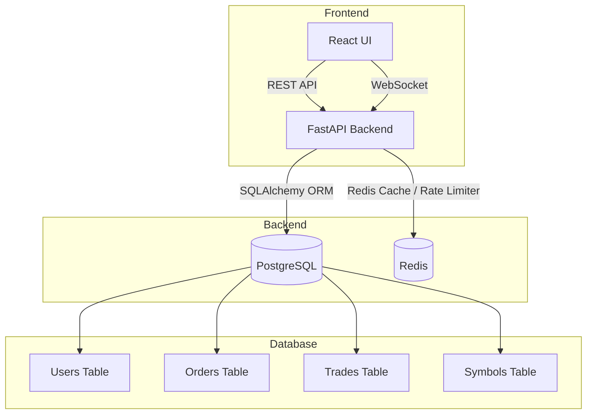

# Trading App 

## Tech Stack
- Frontend : React
- Backend : FastAPI
- Database : PostgreSQL
- In Memory DB : Redis
- Deployment : Docker

## Setup setps
- Step 1 : Clone the repo main branch.
- Step 2 : Make sure you have docker installed and running.
- Step 3 : Run the command `docker compose up --build -d` in the root directory.
- Step 4 : Go to https://localhost:3000 for using the app.

## Architecture

## Test Coverage 

